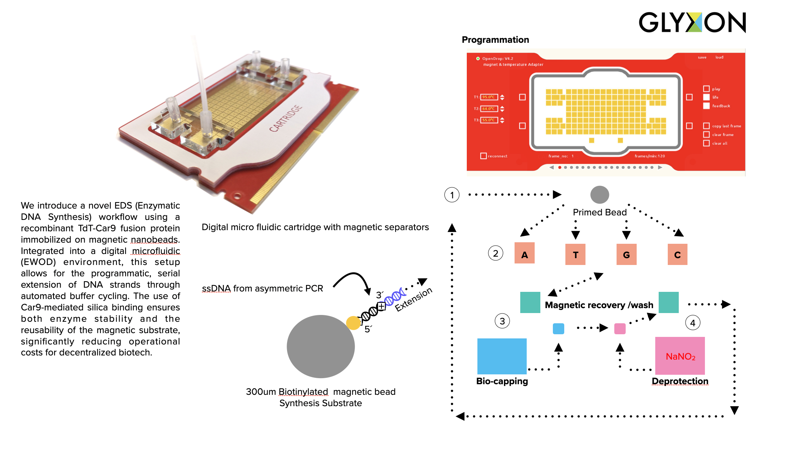
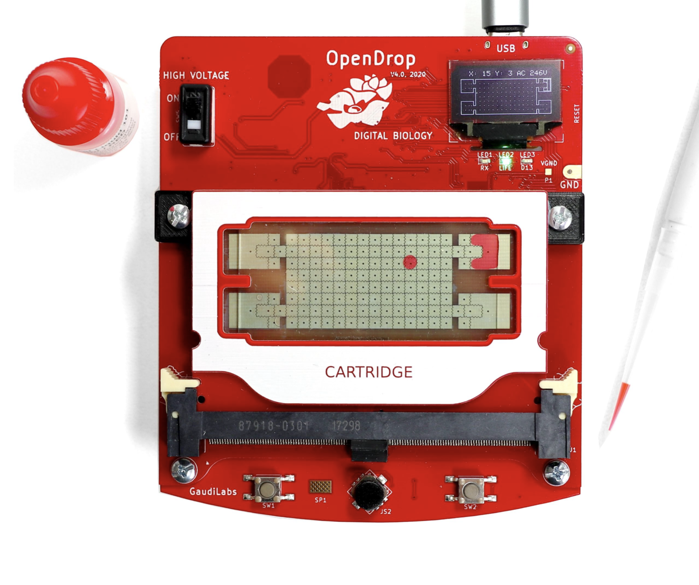
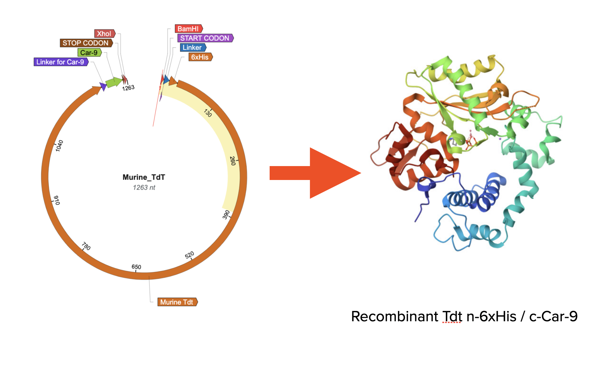

# Open-Synth: Decentralized Enzymatic DNA Synthesis (EDS) 🧬

**Open-Synth** is an open-source platform for *de novo* oligonucleotide synthesis using Digital Microfluidics (EWOD) and enzymatic catalysis. A project by **Glyxon Biolabs**.

## 1. Vision & Hypothesis: Breaking the Synthesis Bottleneck
Current DNA synthesis is a centralized, logistics-heavy bottleneck that limits innovation in independent labs. **Open-Synth** addresses this by building a decentralized **Enzymatic DNA Synthesis (EDS)** platform. 

**Our Hypothesis:** A modified murine Terminal Deoxynucleotidyl Transferase (TdT), coupled with a **Car9 silica-binding domain**, enables controlled, single-nucleotide addition on a digital microfluidics (EWOD) chip. By manipulating 300µm magnetic beads within the **OpenDrop V4.2** system, we aim to produce high-fidelity oligos on-demand, bypassing expensive global logistics.

## 2. Platform & Hardware Infrastructure
Open-Synth is built upon the **OpenDrop** ecosystem developed by **Gaudi Labs**.
* **Core Hardware:** [OpenDrop V4.2](http://www.gaudi.ch/OpenDrop/) – An open-source Electrowetting-on-Dielectric (EWOD) controller.
* **Frugal Innovation:** By leveraging [Gaudi Labs'](http://www.gaudi.ch/) modular design, we empower scientists in the Global South to generate silencing triggers locally, reducing dependence on international shipments.

## 3. Technical Framework: The TdT-Car9 System
Our platform utilizes a recombinant version of murine **TdT**, expressed in *E. coli* with a **6xHis-Car9** dual-tag.
* **Car9 (Silica Binding Domain):** Facilitates high-affinity attachment of the purified protein to silica-coated magnetic nanobeads.
* **Programmatic Synthesis:** The Mag-nano + TdT complex is integrated into the EWOD system, exposed to sequential baths of activation and inhibition buffers for programmatic serial reaction.
* **Sustainability:** Magnetic beads and enzymes are designed for high recovery and multi-cycle reusability.

## 4. Design Artifacts & Structural Biology

### EWOD Cartridge Layout

*Figure 1: Digital Microfluidic (EWOD) cartridge architecture optimized for reagent transport.*

### Platform Interface

*Figure 2: Close-up of the Open-Synth interface based on the Gaudi Labs OpenDrop platform.*

### Protein Engineering

*Figure 3: Structural model of the recombinant TdT-Car9 fusion protein and vector map.*

## 5. Proof-of-Concept: Functional Validation in *C. elegans*
Success is defined by the synthesis of functional **20-40mer DNA oligonucleotides**, validated as templates for in vitro transcription or PCR-generated dsDNA probes. 
* **Ultimate Metric:** The successful induction of known phenotypes in ***C. elegans*** (e.g., *unc-22* or *gfp* silencing) using Open-Synth generated probes. 
* **Next Steps:** Automating the synthesis of RNAi libraries for real-time functional genomics.

## 6. Building a Digital Biology Community
Open-Synth is a catalyst for a decentralized network of researchers. We aim to:
* **Share Protocols:** Open-access workflows for TdT purification and EWOD synthesis cycles.
* **Open Resources:** Collaborative development of digital microfluidic "scripts" for the OpenDrop platform.
* **Community-Led Bio:** Empowering the Global South to iterate biological designs outside traditional institutional silos.

## 7. Scientific Foundations & Bibliography
* **Palluk et al. (2018):** De novo DNA synthesis using TdT-dNTP conjugates. *Nature Biotech*.
* **Houchaimi (2024):** Automated DNA assembly on digital microfluidic devices. *RIT Thesis*.
* **Ashley et al. (2023):** TdT applications in biotechnology and DNA nanotechnology. *PubMed*.
* **U.S. Patent 11,851,651:** Scalable methods for biopolymer synthesis using EWOD systems.

## 8. The Team: A Glyxon-Academic Synergy
* **David J. Castillo, PhD (Project Lead):** Founder of **Glyxon Biolabs**, specializing in frugal science and open-source hardware prototyping (EWOD).
* **Carlos Barba-Ostria, PhD (Biosynthesis):** Expert in protein engineering, leading the optimization of the recombinant **TdT-Car9** system.
* **Biological Validation:** Strategic collaboration with **Dr. Rosa Navarro’s Lab (IFC-UNAM)**, granting access to elite *C. elegans* facilities.

---
*Empowering Decentralized Science through Open Infrastructure.* [www.glyxon.com](https://www.glyxon.com)
